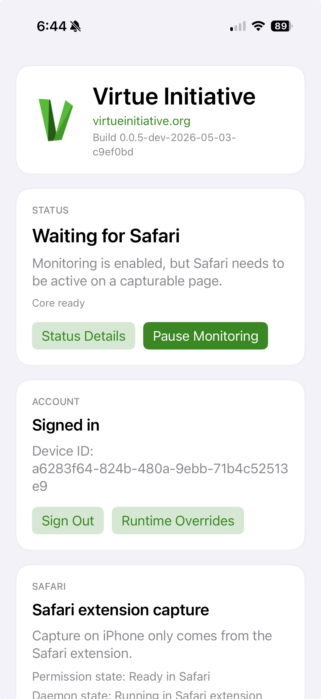

Our sixth release! And our first published release notes.

## Overview

We currently have clients in development for all platforms that can upload screenshots. The Linux, Mac and Windows clients should be installable and testable, but there are still some major bugs (and installation instructions are likely out of date). The andriod and iOS clients are a bit harder to get set up at the moment but we hope to improve that soon.

The web app implements end to end encryption for sharing screenshots with any number of partners which can be invited by email.

## Improvements

### iOS update

iOS got a major user interface overhaul with styling polish and uniformity with other apps and the website. We are seeing a bunch more stability here, with screenshots being submitted when in Safari even over the course of many days. There are still some spurious issues where the capture status moves to the blocked state until either Safari or Virtue is restarted. Expect more stability coming soon! Note that this is not yet in the App Store and we are still only testing on our development devices.

### Other updates

- We added a warning banner ("this is in early dev") to the login and download screens.
- We improved the performance of loading and filtering screenshots using virtualization and caching.
- We fixed some styling on the landing page and added a help button that links to the help pages.
- We fixed the styling of the filters on the logs page.
- We added proper 404 pages.
- We added a new component library to help simplify our styling.

## List of issues fixed
- [Updates for iOS](https://github.com/virtue-initiative/virtue-initiative/pull/346)
- [Log dropdown fixes](https://github.com/virtue-initiative/virtue-initiative/pull/355)
  - [Device buttons aren't the same width](https://github.com/virtue-initiative/virtue-initiative/issues/328)
  - [Fix UI dropdowns](https://github.com/virtue-initiative/virtue-initiative/issues/348)
- [Added nicer 404 pages](https://github.com/virtue-initiative/virtue-initiative/pull/357)
  - [Add a 404 to the landing page](https://github.com/virtue-initiative/virtue-initiative/issues/338)
- [Improved about styling and added help button](https://github.com/virtue-initiative/virtue-initiative/pull/358)
  - [Fix wrapping](https://github.com/virtue-initiative/virtue-initiative/issues/330)
  - [Improve about page styling](https://github.com/virtue-initiative/virtue-initiative/issues/332)
  - [No link to docs from landing page](https://github.com/virtue-initiative/virtue-initiative/issues/339)
- [New component library](https://github.com/virtue-initiative/virtue-initiative/pull/359)
- [Added a resend verification email link to the login error](https://github.com/virtue-initiative/virtue-initiative/pull/361)
  - [Add resend verification email button to login screen](https://github.com/virtue-initiative/virtue-initiative/issues/335)
- [Added some agent instructions for CLAUDE](https://github.com/virtue-initiative/virtue-initiative/pull/369)
- [Single details dialog](https://github.com/virtue-initiative/virtue-initiative/pull/368)
- [Fixed the invite flow with a new account](https://github.com/virtue-initiative/virtue-initiative/pull/363)
  - [Invalid or expired invite shown three times when accepting an invitation](https://github.com/virtue-initiative/virtue-initiative/issues/317)
  - [Partner invite with a new account fails due to email verification](https://github.com/virtue-initiative/virtue-initiative/issues/362)
- [Simple max batch size fix](https://github.com/virtue-initiative/virtue-initiative/pull/364)
  - [Batch upload is limited to 25 items](https://github.com/virtue-initiative/virtue-initiative/issues/325)
- [Added a basic hash server](https://github.com/virtue-initiative/virtue-initiative/pull/367)
  - [Create seperate hashing server](https://github.com/virtue-initiative/virtue-initiative/issues/30)
- [Post 2026-05-16: How our security works](https://github.com/virtue-initiative/virtue-initiative/pull/353)
- [Better core test harness](https://github.com/virtue-initiative/virtue-initiative/pull/380)

