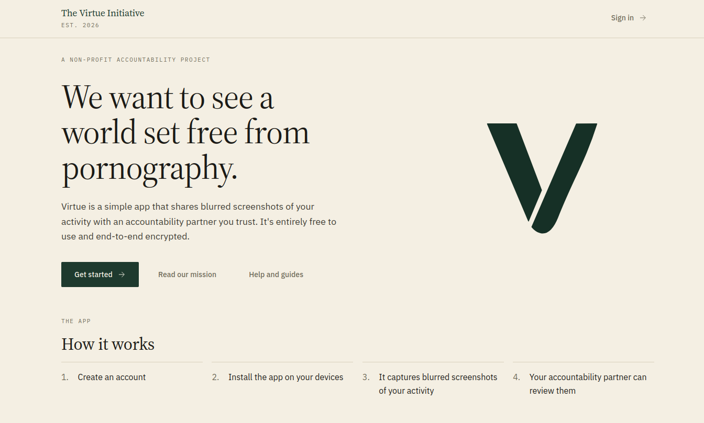
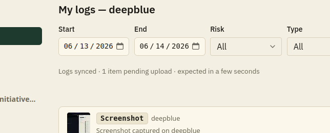

This release introduces a new app design and logo, and brings major improvements to the organization of the codebase.

## Styling update

We're redoing our design and logo. We've updated the colors throughout the website and redid the landing page. There's still more work to be done (all the client apps need their colors updated), but we think it looks great so far.

## Web login flow updated

We updated the sign-in flow to simplify some of the code. It also prevents some weird edge cases where you start the signup on one device and finish it on another device. Instead of creating an account and then verifying your email, we now have you verify your email and then finish creating your account.

## Pending upload count

We added a pending upload count to the logs UI. It shows the number of screenshots still waiting to be uploaded.

## Internal improvements

We updated the core code shared between all the client apps and simplified it to make extending it in the future simpler and to make the tampering detection more reliable, though tampering detection still needs a bit of work.

## List of all updates and fixes

- [Updated version to 0.0.7](https://github.com/virtue-initiative/virtue-initiative/pull/382)
- [Android UI updates and move to use accessibility](https://github.com/virtue-initiative/virtue-initiative/pull/386)
- [Web API backend refactor](https://github.com/virtue-initiative/virtue-initiative/pull/387)
  - [Change signup flow to email -> verify -> setup account](https://github.com/virtue-initiative/virtue-initiative/issues/384)
  - [Fix styling of the list of items in the log view](https://github.com/virtue-initiative/virtue-initiative/issues/385)
  - [Clean up component heights](https://github.com/virtue-initiative/virtue-initiative/issues/389)
- [Fixed download page icons](https://github.com/virtue-initiative/virtue-initiative/pull/390)
  - [Fix download page styles](https://github.com/virtue-initiative/virtue-initiative/issues/383)
- [Fixed linux terminal input](https://github.com/virtue-initiative/virtue-initiative/pull/391)
  - [Better terminal input on linux](https://github.com/virtue-initiative/virtue-initiative/issues/379)
- [Created better log descriptions in the UI](https://github.com/virtue-initiative/virtue-initiative/pull/394)
  - [Remove "type" dropdown from gallery view](https://github.com/virtue-initiative/virtue-initiative/issues/374)
  - [Create user friendly messages for the lifecycle events](https://github.com/virtue-initiative/virtue-initiative/issues/375)
- [Added web tests](https://github.com/virtue-initiative/virtue-initiative/pull/396)
- [Added pending uploads to the hash state](https://github.com/virtue-initiative/virtue-initiative/pull/395)
  - [Improve log status display](https://github.com/virtue-initiative/virtue-initiative/issues/388)
- [Improve error messages in client/core](https://github.com/virtue-initiative/virtue-initiative/pull/397)
- [Add mac intel build](https://github.com/virtue-initiative/virtue-initiative/pull/401)
  - [Build intel Mac installer](https://github.com/virtue-initiative/virtue-initiative/issues/400)
- [Add QA checklists for each client platform](https://github.com/virtue-initiative/virtue-initiative/pull/403)
  - [Add QA checklists for each client platform](https://github.com/virtue-initiative/virtue-initiative/issues/402)
- [Updated theme and removed dark mode and fixed staging api](https://github.com/virtue-initiative/virtue-initiative/pull/405)
  - [HASH_SERVER_URL needs fixed in staging (and likely prod)](https://github.com/virtue-initiative/virtue-initiative/issues/404)
- [Landing page style pass](https://github.com/virtue-initiative/virtue-initiative/pull/412)
- [Add optional rollup native lib for mac](https://github.com/virtue-initiative/virtue-initiative/pull/415)
- [Remove /hash in env var](https://github.com/virtue-initiative/virtue-initiative/pull/416)
- [Updated logo to match color](https://github.com/virtue-initiative/virtue-initiative/pull/417)
- [Moving core to an event model](https://github.com/virtue-initiative/virtue-initiative/pull/406)
