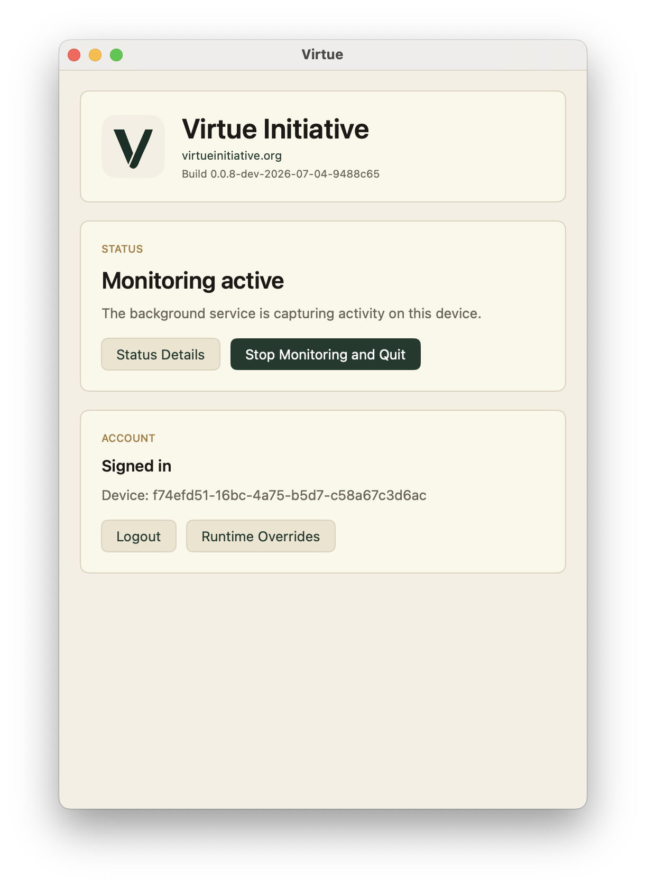
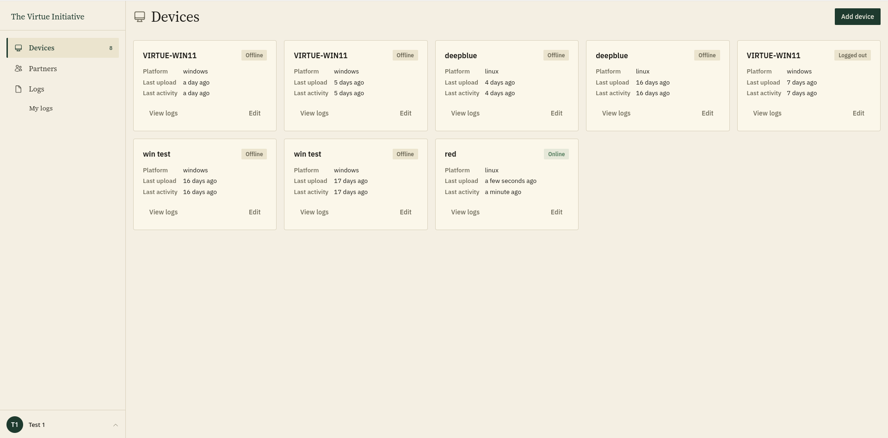
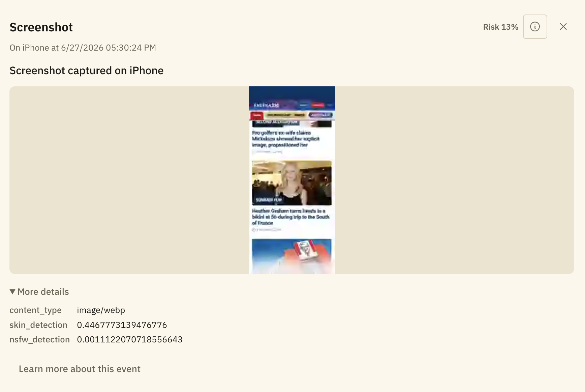
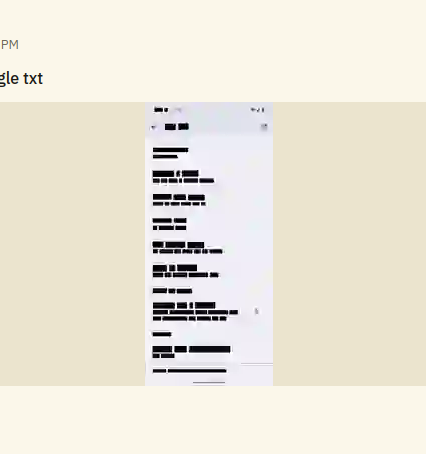
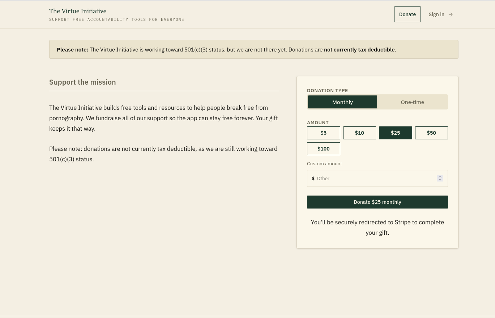

This release brings redesigned clients, nsfw image classification, screenshot text detection and redaction, a new donations page, and a simplified auth and device model.

As of this release, most essential features are at least mostly working (or seem to be). Over the next month or two, we intend to focus on polishing the installation flow and preparing it for a more stable beta release that people can install and use.

## New look across every platform

The Mac client has been rewritten from scratch, moving from Rust/AppKit to SwiftUI. iOS, Android, and Windows have all been updated to match the new theme, and the website has been redone with a sidebar-based layout, consistent page headings, and a typography pass.

## Screenshot classification and text detection & redaction

We added a small on device model that assigns a score to each screenshot based on how likely it is to contain NSFW content.

We also added a OCR library for detecting text in screenshots. Currently, we use this for redacting text in screenshots, but eventually we would like to run the on-screen text through a classifer so that NSFW text (such as an explict story) is detected as well.

## Donations page

We added a donations page powered by Stripe Checkout, making it easy to support the project directly. Donations are not currently tax-deductable, but we are working towards 501(c)3 status.

## Devices are now marked as deleted on logout

Devices are now marked as deleted in the UI (but screenshots are still visible) when you log out on the device. We also simplified some internal auth and session code for the devices.

## Better lifecycle & login handling

We worked on improving our model for detecting unexpected gaps in monitoring. Our new model works on the assumption that a session begins when a user logs into their computer and ends when a user logs out of/shuts down their computer. Any gap in between (except suspend, i.e. closing the laptop lid), is detected as an unexpected gap and creates an alert that partners can see.

We also allow you to set your device name when logging in (previously it could only be changed from the website).

## Internal reliability & diagnostics

We rolled out consistent logging across every platform for better debug information. We also started pruning batches older than 30 days and added upload retry backoff and API rate limiting.

## Everything else

On top of the above, this release includes a bunch of smaller fixes and polish across the apps and website, a new Code of Conduct, trimmed-down issue and PR templates, and various CI and dev-tooling reliability fixes.

## List of all updates and fixes

- [Release notes 0.0.7](https://github.com/virtue-initiative/virtue-initiative/pull/419)
- [Async decryption](https://github.com/virtue-initiative/virtue-initiative/pull/420)
- [Added image risk classification](https://github.com/virtue-initiative/virtue-initiative/pull/422)
- [Improved log icons](https://github.com/virtue-initiative/virtue-initiative/pull/423)
  - [Improve icons and titles for alerts](https://github.com/virtue-initiative/virtue-initiative/issues/421)
- [Add issue and PR templates](https://github.com/virtue-initiative/virtue-initiative/pull/433)
- [Improve detecting inactivity](https://github.com/virtue-initiative/virtue-initiative/pull/426)
  - [Detect inactivity and stop taking screenshots](https://github.com/virtue-initiative/virtue-initiative/issues/278)
  - [Detect inactivity and stop taking screenshots on linux](https://github.com/virtue-initiative/virtue-initiative/issues/279)
  - [Detect inactivity and stop taking screenshots on windows](https://github.com/virtue-initiative/virtue-initiative/issues/280)
  - [Detect inactivity and stop taking screenshots on macos](https://github.com/virtue-initiative/virtue-initiative/issues/281)
- [Added optional device name to login](https://github.com/virtue-initiative/virtue-initiative/pull/425)
  - [Allow specifying device name when logging in on Linux](https://github.com/virtue-initiative/virtue-initiative/issues/407)
  - [Allow specifying the device name on login on windows](https://github.com/virtue-initiative/virtue-initiative/issues/408)
  - [Allow specifying the device name on login on mac](https://github.com/virtue-initiative/virtue-initiative/issues/409)
  - [Allow specifying the device name on login on iOS](https://github.com/virtue-initiative/virtue-initiative/issues/410)
  - [Allow specifying the device name on login on Android](https://github.com/virtue-initiative/virtue-initiative/issues/411)
- [Fix typos and grammar in security article](https://github.com/virtue-initiative/virtue-initiative/pull/434)
  - [Use the correct word in the security blog](https://github.com/virtue-initiative/virtue-initiative/issues/398)
- [Monochrome Mac tray icon](https://github.com/virtue-initiative/virtue-initiative/pull/437)
  - [Monochrome tray icon on Mac](https://github.com/virtue-initiative/virtue-initiative/issues/436)
- [Added async image processing and ping gap budget](https://github.com/virtue-initiative/virtue-initiative/pull/438)
- [Redo main website to be sidebar based](https://github.com/virtue-initiative/virtue-initiative/pull/439)
- [Match new theme on iOS](https://github.com/virtue-initiative/virtue-initiative/pull/440)
  - [Update iOS app to new design](https://github.com/virtue-initiative/virtue-initiative/issues/429)
- [Android and windows style update](https://github.com/virtue-initiative/virtue-initiative/pull/441)
  - [Update Andriod app to new design](https://github.com/virtue-initiative/virtue-initiative/issues/430)
  - [Update windows app to new design](https://github.com/virtue-initiative/virtue-initiative/issues/432)
- [Switch to bun, fix Preact JSX in Astro, fix API email links](https://github.com/virtue-initiative/virtue-initiative/pull/445)
- [Fix #443: Replace custom DateRangePicker with native select](https://github.com/virtue-initiative/virtue-initiative/pull/446)
  - [Use normal dropdown - better for mobile](https://github.com/virtue-initiative/virtue-initiative/issues/443)
- [Fix: Cache failed batch decryptions to prevent endless retries](https://github.com/virtue-initiative/virtue-initiative/pull/447)
  - [Web keeps trying to decrypt logs even if it failed the first time](https://github.com/virtue-initiative/virtue-initiative/issues/393)
- [Multi-instance Linux client support (issue #444)](https://github.com/virtue-initiative/virtue-initiative/pull/448)
  - [Support running two instances of the app on linux](https://github.com/virtue-initiative/virtue-initiative/issues/444)
- [Improve typography on blog, help, legal, and about pages](https://github.com/virtue-initiative/virtue-initiative/pull/450)
  - [Typography update on blog and help pages](https://github.com/virtue-initiative/virtue-initiative/issues/428)
- [Fix #449: add background to Linux system tray icon](https://github.com/virtue-initiative/virtue-initiative/pull/451)
  - [It is really hard to see the app icon](https://github.com/virtue-initiative/virtue-initiative/issues/449)
- [Add Heartbeat log type to Rust core (#299)](https://github.com/virtue-initiative/virtue-initiative/pull/452)
  - [Send log once a day on devices that are online](https://github.com/virtue-initiative/virtue-initiative/issues/299)
- [Run blocking calls off main thread on iOS and Windows](https://github.com/virtue-initiative/virtue-initiative/pull/442)
  - [Windows doesn't show login error with invalid password](https://github.com/virtue-initiative/virtue-initiative/issues/413)
- [Fix #453, #454: squarish sidebar style and auto-select first Logs child](https://github.com/virtue-initiative/virtue-initiative/pull/457)
  - [Clicking Logs in the sidebar should default select the first listed user instead of doing nothing](https://github.com/virtue-initiative/virtue-initiative/issues/453)
  - [Make some corners less rounded and normalize sidebar highlight](https://github.com/virtue-initiative/virtue-initiative/issues/454)
- [Fix #456: Style info button as ghost button matching close button](https://github.com/virtue-initiative/virtue-initiative/pull/464)
  - [Make info button a ghost button like the close button](https://github.com/virtue-initiative/virtue-initiative/issues/456)
- [Consistent page heading design for Logs, Devices, Partners, Settings](https://github.com/virtue-initiative/virtue-initiative/pull/462)
  - [Redesign main website](https://github.com/virtue-initiative/virtue-initiative/issues/427)
  - [Make help point to the correct staging/prod url](https://github.com/virtue-initiative/virtue-initiative/issues/455)
- [Fix #461: use staging API URL by default in dev/staging builds](https://github.com/virtue-initiative/virtue-initiative/pull/463)
  - [Use the staging URL by default in dev builds](https://github.com/virtue-initiative/virtue-initiative/issues/461)
- [Add skin/nsfw raw scores to screenshot logs and fix risk=0 on all platforms](https://github.com/virtue-initiative/virtue-initiative/pull/465)
  - [MacOS doesn't get a screenshot rating](https://github.com/virtue-initiative/virtue-initiative/issues/458)
  - [Android doesn't get a screenshot rating](https://github.com/virtue-initiative/virtue-initiative/issues/459)
  - [iOS doesn't get a screenshot rating](https://github.com/virtue-initiative/virtue-initiative/issues/460)
- [Simplify API auth to session + device tokens (#466)](https://github.com/virtue-initiative/virtue-initiative/pull/469)
  - [Simplify API auth](https://github.com/virtue-initiative/virtue-initiative/issues/466)
- [Fix #470: noindex meta tag on staging pages](https://github.com/virtue-initiative/virtue-initiative/pull/473)
  - [Add noindex meta tag to staging pages](https://github.com/virtue-initiative/virtue-initiative/issues/470)
- [Optimize device list queries to avoid batches join row-explosion](https://github.com/virtue-initiative/virtue-initiative/pull/476)
- [Simplify device settings to single wrapping_keys list](https://github.com/virtue-initiative/virtue-initiative/pull/475)
  - [Simplify device settings](https://github.com/virtue-initiative/virtue-initiative/issues/468)
- [Fix false-positive Unexpected Restart / Unexpected Gap alerts on iOS](https://github.com/virtue-initiative/virtue-initiative/pull/481)
  - [Fixup "Unexpected Gap" and "Unexpected Restart" alerts on iOS](https://github.com/virtue-initiative/virtue-initiative/issues/435)
- [Fix #467: replace direct-log endpoint with encrypted batch + notify pipeline](https://github.com/virtue-initiative/virtue-initiative/pull/478)
  - [Remove seperate log endpoint](https://github.com/virtue-initiative/virtue-initiative/issues/467)
- [Trim issue/PR templates to 3 sections max](https://github.com/virtue-initiative/virtue-initiative/pull/487)
  - [Clean up feature/bug/pr templates](https://github.com/virtue-initiative/virtue-initiative/issues/479)
- [Polish devices/logs UI: pending count, sidebar user display, loading state](https://github.com/virtue-initiative/virtue-initiative/pull/486)
  - [Fix email color and style](https://github.com/virtue-initiative/virtue-initiative/issues/474)
  - [Says "no devices" when loading devices](https://github.com/virtue-initiative/virtue-initiative/issues/477)
  - [Clean up user display area](https://github.com/virtue-initiative/virtue-initiative/issues/480)
  - [Add "Logs pending upload" to the "all devices" page](https://github.com/virtue-initiative/virtue-initiative/issues/483)
- [Upgrade Astro to v7 in landing/](https://github.com/virtue-initiative/virtue-initiative/pull/488)
  - [Upgrade astro](https://github.com/virtue-initiative/virtue-initiative/issues/482)
- [Rewrite Mac client UI from Rust/AppKit to SwiftUI (#431)](https://github.com/virtue-initiative/virtue-initiative/pull/493)
- [Text detection/OCR library with screenshot redaction](https://github.com/virtue-initiative/virtue-initiative/pull/489)
- [Add Code of Conduct](https://github.com/virtue-initiative/virtue-initiative/pull/497)
  - [Add a code of conduct](https://github.com/virtue-initiative/virtue-initiative/issues/196)
- [Add donations page with Stripe Checkout (#471)](https://github.com/virtue-initiative/virtue-initiative/pull/472)
  - [Add donations page with Stripe Checkout](https://github.com/virtue-initiative/virtue-initiative/issues/471)
- [Rewrite lifecycle tracking as a login/logout expected-window model](https://github.com/virtue-initiative/virtue-initiative/pull/494)
  - [Act reasonably on logout/login - linux](https://github.com/virtue-initiative/virtue-initiative/issues/490)
  - [Act reasonably on logout/login - mac](https://github.com/virtue-initiative/virtue-initiative/issues/491)
  - [Act reasonably on logout/login - windows](https://github.com/virtue-initiative/virtue-initiative/issues/492)
- [Increase deploy timeout](https://github.com/virtue-initiative/virtue-initiative/pull/503)
  - [Increase deploy timeout](https://github.com/virtue-initiative/virtue-initiative/issues/499)
- [Add upload retry backoff and API rate limiting](https://github.com/virtue-initiative/virtue-initiative/pull/502)
- [Fix Windows app flashing "logged out" during status load](https://github.com/virtue-initiative/virtue-initiative/pull/506)
  - [Windows app slow to update login](https://github.com/virtue-initiative/virtue-initiative/issues/501)
- [Soft-delete devices and reset hash state on client logout (#484)](https://github.com/virtue-initiative/virtue-initiative/pull/505)
  - [Clear pending uploads and mark device as deleted on logout](https://github.com/virtue-initiative/virtue-initiative/issues/484)
- [Single source of truth for default capture/batch intervals (#496)](https://github.com/virtue-initiative/virtue-initiative/pull/504)
  - [Ensure default capture/batch intervals come from a single source of truth](https://github.com/virtue-initiative/virtue-initiative/issues/496)
- [Sign Android release APKs](https://github.com/virtue-initiative/virtue-initiative/pull/512)
- [Bundle libtesseract/liblept/libjpeg into the .deb, build against Debian oldstable](https://github.com/virtue-initiative/virtue-initiative/pull/514)
  - [Make deb file depend on tesseract](https://github.com/virtue-initiative/virtue-initiative/issues/513)
- [Prune batches older than 30 days on the hourly cron (#509)](https://github.com/virtue-initiative/virtue-initiative/pull/516)
  - [Clear logs after 30 days](https://github.com/virtue-initiative/virtue-initiative/issues/509)
- [core: add tracing-based logging (1/6)](https://github.com/virtue-initiative/virtue-initiative/pull/517)
- [linux: install tracing subscriber, migrate daemon/tray diagnostics (2/6)](https://github.com/virtue-initiative/virtue-initiative/pull/518)
- [Extend boot/gap alert thresholds (#511)](https://github.com/virtue-initiative/virtue-initiative/pull/515)
  - [Extend allowed boot gap duration](https://github.com/virtue-initiative/virtue-initiative/issues/511)
- [mac: install tracing subscriber with daily-rotated file (3/6)](https://github.com/virtue-initiative/virtue-initiative/pull/519)
- [windows: install tracing subscriber with daily-rotated file (4/6)](https://github.com/virtue-initiative/virtue-initiative/pull/520)
- [ios: install tracing subscriber, migrate daemon-loop diagnostic (6/6)](https://github.com/virtue-initiative/virtue-initiative/pull/522)
- [android: install tracing subscriber, migrate daemon-loop diagnostic (5/6)](https://github.com/virtue-initiative/virtue-initiative/pull/521)
- [Fix custom donation amount silently blocking decimal submissions](https://github.com/virtue-initiative/virtue-initiative/pull/538)
  - [Donation custom-amount field silently blocks submission for non-whole-dollar amounts](https://github.com/virtue-initiative/virtue-initiative/issues/525)
- [Fix landing dev-port links in plain-HTTP dev mode](https://github.com/virtue-initiative/virtue-initiative/pull/537)
  - [landing's Sign in/signup links point to the wrong port in plain-HTTP dev mode](https://github.com/virtue-initiative/virtue-initiative/issues/524)
- [Fix missing log labels, heartbeat restore, dev tooling](https://github.com/virtue-initiative/virtue-initiative/pull/540)
- [ci: fix stale mac cache, eliminate duplicate Rust builds, fix Linux Docker cache gap](https://github.com/virtue-initiative/virtue-initiative/pull/535)
