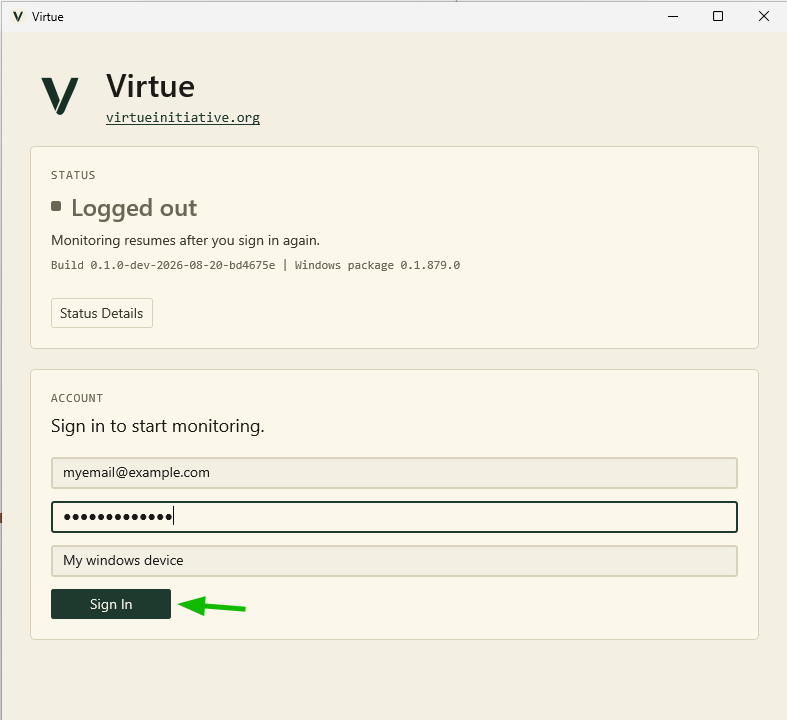
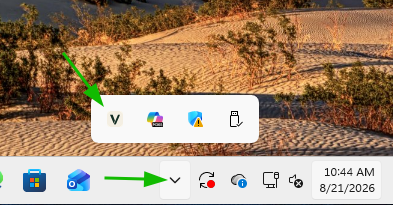
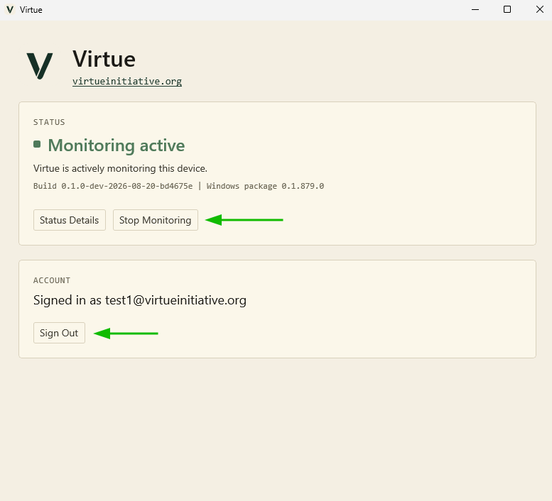
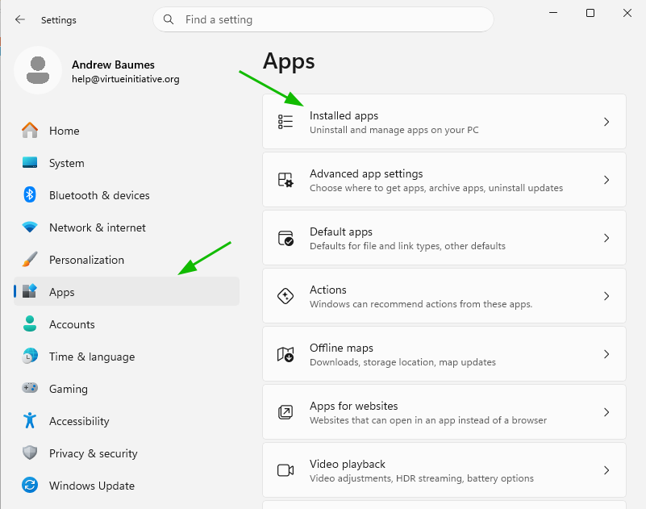
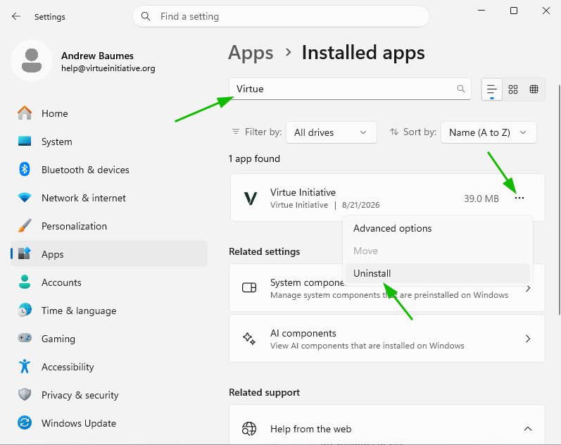

## Windows installation

1. If you do not have one, [create an account](/signup).
2. Install Virtue from the [Microsoft Store]({WINDOWS_DOWNLOAD}).
3. Once complete, launch Virtue and sign in with your account.
   
4. Done! The app will periodically collect screenshots (about once every 5 minutes) and upload them once an hour. You and your partners will be able to view them from the logs page on the website.

## Usage

**To log out or pause monitoring**

1. Open the app. (You can do this from the tray in the bottom right.)
   
2. Hit logout (permanant) or pause monitoring (temporary). **Note: after you log out, logging back in will create a new device in your account. If you just want to stop monitoring, use "Stop Monitoring" instead**.
   
3. Done! **Note: the service will send an alert if you pause monitoring**

## Uninstall

1. Go to Settings
2. Click "Apps" then "Installed Apps".
   
3. Search for "Virtue"
4. Click "Uninstall"
   
