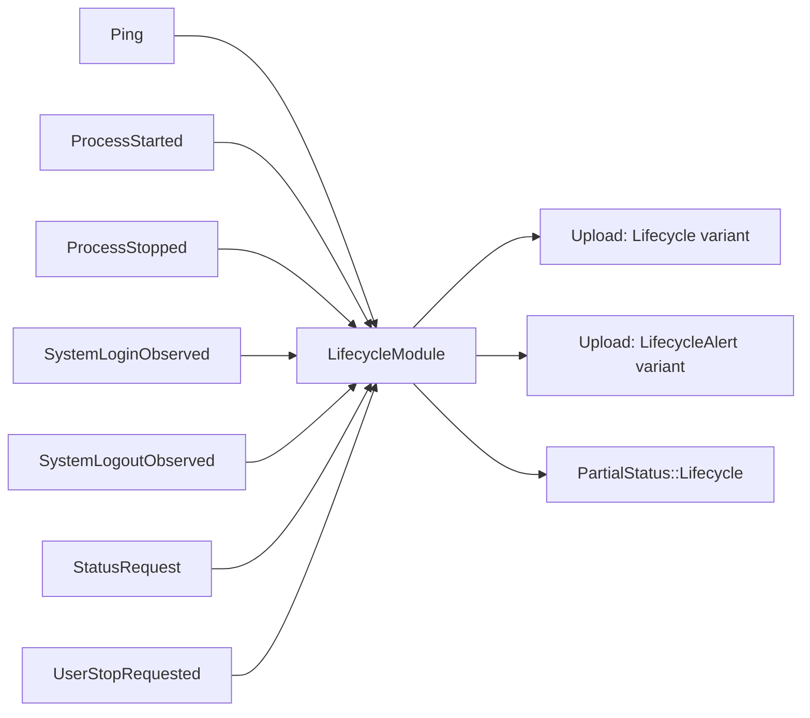
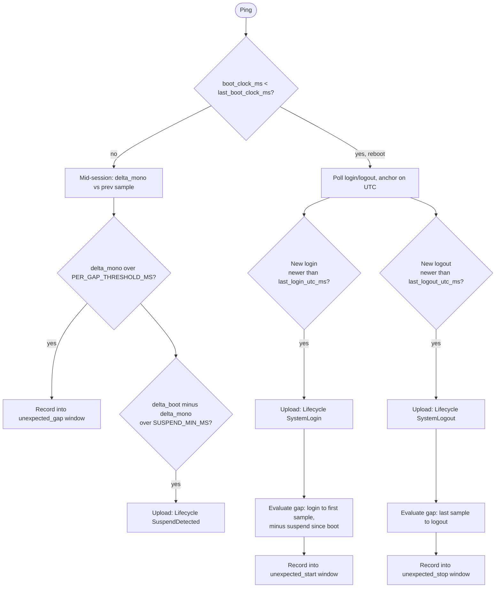
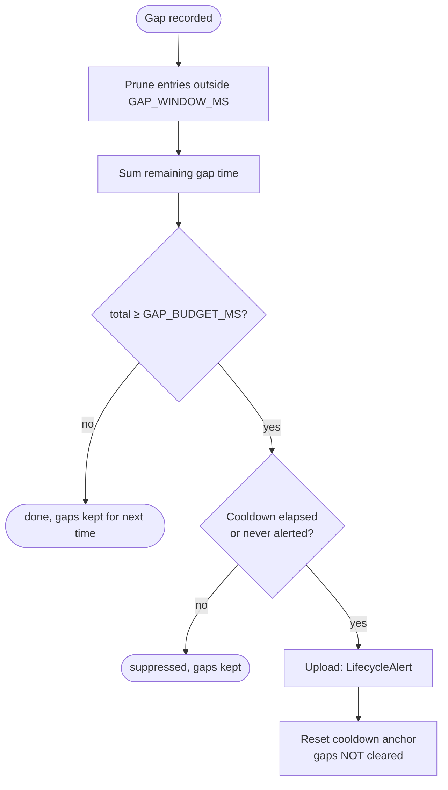

# Lifecycle events

Last Updated: 2026-07-09

`LifecycleModule` (`client/core/src/module/lifecycle.rs`) is one of the eight
observers on the client's event bus. Its job: the monitoring process is
_expected_ to run for a known window — login → logout — and the module
detects any stretch of that window where it wasn't running, excluding
suspend. Suspend is identified by comparing a boot clock (includes suspend)
against a monotonic clock (excludes suspend) each `Ping`, not by subscribing
to OS sleep/wake events.

## Overview

The module holds no "currently suspended" state — suspend is only knowable
retrospectively, once the gap closes. Instead it tracks the previous
heartbeat's clock readings and, each `Ping`, computes the delta against the
current reading. Everything reduces to _"expected-running time not covered
by a heartbeat, minus suspend."_

`SystemLoginObserved`/`SystemLogoutObserved` are optional, platform-pushed
events carrying an exact timestamp (used where a real-time OS signal exists,
e.g. Windows' `WM_ENDSESSION`). They're a latency optimization only — the
module also polls `LifecycleHooks::get_last_login_utc_ms`/
`get_last_logout_utc_ms` on a coarse cadence, so a platform with no push
signal still gets full coverage.

## The five system hooks

Everything the module needs comes from `LifecycleHooks`
(`client/core/src/platform.rs`), implemented once per platform:

| Hook                     | Meaning                                      |
| ------------------------ | -------------------------------------------- |
| `get_utc_clock_ms`       | Wall clock                                   |
| `get_boot_clock_ms`      | Time since boot, **includes** suspend        |
| `get_monotonic_clock_ms` | Time since boot, **excludes** suspend        |
| `get_last_login_utc_ms`  | Start of the current expected-running window |
| `get_last_logout_utc_ms` | End of the most recently closed window       |

`get_boot_clock_ms`/`get_monotonic_clock_ms` are cheap syscalls read on
every `Ping` (~1/s) — that's what drives gap detection. The login/logout
hooks can be expensive (D-Bus round-trips, subprocess shell-outs) and are
throttled to a coarse poll (5 min), forced early by `ProcessStarted` or a
detected reboot.

## Gap detection: three buckets

A gap can appear in three places — the two edges of the login→logout window,
and the middle:

Each of the three buckets (`unexpected_gap`, `unexpected_start`,
`unexpected_stop`) shares the same sliding-window gap-budget mechanism
described below — a single stall shouldn't alert on its own.

- **Unexpected gap (mid-session):** `Δmonotonic` between two consecutive
  samples in the same boot. Monotonic already excludes suspend, so the delta
  directly measures awake-but-unsampled time — crash, force-kill-and-restart,
  or a frozen process. `Δboot − Δmonotonic` is the suspend portion, logged
  separately as `SuspendDetected` (informational, not an alert).
- **Unexpected start:** awake time between a newly observed login and the
  first heartbeat sample since — the session was live and awake but the
  monitor wasn't running yet (disabled autostart, late launch). Suspend
  accumulated since boot is backed out conservatively, since there's no
  clock sample at the exact moment of login.
- **Unexpected stop:** gap between the last known-alive sample and the
  session's logout — the monitor stopped before the session ended
  (deliberate quit or kill before logout). When the logout timestamp is
  itself a reconstructed floor (unclean shutdown), it sits at or before the
  true end, so the gap can only shrink, never be invented — a simultaneous
  force-kill + power-pull correctly produces ~0 gap and stays silent.

A reboot (`boot_clock_ms` regressing below the last recorded value) resets
the boot-relative clocks, so mid-session math is skipped for that tick and
the edge checks anchor on UTC + the login/logout hooks instead.

## Sliding-window gap budget

A single slow loop iteration briefly stalling `Ping` shouldn't alert on its
own, so each bucket's gaps are recorded into a window and summed — the alert
fires on sustained gap _budget_, not any one gap.

Because a bucket's gaps are never cleared on alert, a chronic stall keeps
re-alerting every cooldown window, while a one-off burst simply ages out of
the 10-minute window on its own.

## User-initiated stop

An explicit user-initiated stop (`ProcessStopped(User)`, from the tray/CLI
"quit" action) fires its own immediate `UserStop` alert (`EXTRA_HIGH_RISK`)
independently of the gap model — nothing about a user-initiated stop
suppresses or excuses the later unexpected-stop evaluation. When the
session's logout eventually arrives, the resulting gap is still
independently evaluated: both signals can exist for the same incident.

## The closed event/alert set

Exactly seven lifecycle log entries exist — no more, no less. Routine
process-start/stop bookkeeping (`ProcessStarted`/`ProcessStopped`) still
drives the state machine internally (deciding when to poll login/logout,
detecting an explicit user stop) but produces no visible log row of its own.

| Kind/reason       | Risk                                       | Payload       |
| ----------------- | ------------------------------------------ | ------------- |
| `SuspendDetected` | 0.0 (informational)                        | `duration_ms` |
| `SystemLogin`     | 0.0 (informational)                        | `utc_ms`      |
| `SystemLogout`    | 0.0 (informational)                        | `utc_ms`      |
| `UnexpectedStart` | `HIGH_RISK_LIFECYCLE_ALERT` (0.8, batched) | —             |
| `UnexpectedStop`  | `HIGH_RISK_LIFECYCLE_ALERT` (0.8, batched) | —             |
| `UnexpectedGap`   | `HIGH_RISK_LIFECYCLE_ALERT` (0.8, batched) | —             |
| `UserStop`        | `EXTRA_HIGH_RISK` (0.9, immediate/emailed) | —             |

There is no clean-vs-reconstructed distinction on `UnexpectedStop` — a
killed-before-shutdown gap is always the same risk tier, regardless of
whether the logout timestamp came from an exact push or a reconstructed
floor.

`HIGH_RISK_LIFECYCLE_ALERT` is intentionally kept just below
`EXTRA_HIGH_RISK`: the upload module routes `risk >= EXTRA_HIGH_RISK`
through the immediate, emailed path, so common non-urgent alerts ride the
normal batch instead of paging anyone.

## Tunable constants

Defined at the top of `lifecycle.rs`:

| Constant                    | Value  | Meaning                                                        |
| --------------------------- | ------ | -------------------------------------------------------------- |
| `PER_GAP_THRESHOLD_MS`      | 10s    | Minimum size for a single gap to be recorded                   |
| `GAP_WINDOW_MS`             | 10 min | Sliding window gaps are summed over                            |
| `GAP_BUDGET_MS`             | 60s    | Total gap time in the window that triggers an alert            |
| `GAP_ALERT_COOLDOWN_MS`     | 5 min  | Minimum time between repeat alerts, per bucket                 |
| `SUSPEND_MIN_MS`            | 5s     | Minimum boot-vs-monotonic divergence worth logging             |
| `LOGIN_POLL_INTERVAL_MS`    | 5 min  | Coarse cadence for the (possibly expensive) login/logout hooks |
| `EXTRA_HIGH_RISK`           | 0.9    | Immediate/emailed alert threshold                              |
| `HIGH_RISK_LIFECYCLE_ALERT` | 0.8    | Batched but noteworthy                                         |

## What actually generates each event, per platform

`LifecycleModule` only reacts to hook readings and pushed events; it never
decides _when_ a login, logout, or suspend happened beyond what the hooks
report. This section is the map from OS signal to `LifecycleHooks`.

### Linux (`client/linux/src/daemon.rs`, `capture.rs`)

- **`get_boot_clock_ms`/`get_monotonic_clock_ms`**: `libc::clock_gettime`
  with `CLOCK_BOOTTIME`/`CLOCK_MONOTONIC`.
- **`get_last_login_utc_ms`**: reads the primary graphical session's
  `Timestamp` property over the same logind D-Bus session proxy already used
  for lock-state detection.
- **`get_last_logout_utc_ms`**: `journalctl --list-boots -o json`, the
  `last_entry` timestamp of the previous boot — a floor, not exact. Needs
  persistent journald logging (`Storage=persistent`); returns `None`
  otherwise.
- **`SystemLogoutObserved`**: sent from `record_shutdown_transition()` when
  the daemon catches `SIGTERM`/`SIGINT` and `classify_shutdown_reason()`
  (shells out to `systemctl is-system-running`/`systemctl list-jobs`)
  resolves to `Shutdown` — an `Other` or `User` stop doesn't claim to know an
  exact logout time.
- No real-time suspend/resume subscription exists anymore — the systemd-logind
  `PrepareForSleep` D-Bus watcher was removed; suspend is derived purely from
  clock divergence.

### macOS (`client/mac/src/daemon.rs`, `capture.rs`)

- **`get_boot_clock_ms`/`get_monotonic_clock_ms`**: hand-rolled FFI to
  `mach_continuous_time()`/`mach_absolute_time()` + `mach_timebase_info`.
- **`get_last_login_utc_ms`**: parses unfiltered `last -F` output for the
  most recent non-`reboot`/non-`shutdown` entry.
- **`get_last_logout_utc_ms`**: `last -1 -F shutdown`, parsed the same way
  as before — a floor.
- **`SystemLogoutObserved`**: still sent from
  `NSWorkspaceWillPowerOffNotification`, observed on a dedicated
  `ShutdownWatcher` thread — this is a shutdown notification, not the
  suspend/resume subscription that was removed.
- The `IORegisterForSystemPower` IOKit watcher (suspend/resume) was removed
  entirely. The daemon now derives "just resumed" locally each tick from its
  own boot-vs-monotonic divergence check, purely to drive the post-wake
  capture-suppression window and a prompt `FlushBatchNow` — independent of
  `LifecycleModule`'s own suspend detection.

### Windows (`Virtue.WindowsApp.Core/Tray/WindowsTrayIconHost.cs` + `client/windows/src/{ffi.rs,resident_monitor.rs,capture.rs}`)

- **`get_boot_clock_ms`/`get_monotonic_clock_ms`**: `QueryInterruptTime`
  (includes suspend) / `QueryUnbiasedInterruptTime` (excludes suspend).
- **`get_last_login_utc_ms`**: unchanged from before — reads the current
  session's LSA logon time via `LsaGetLogonSessionData`. (Despite living in a
  function historically named around "startup," this was always logon time,
  not machine boot time.)
- **`get_last_logout_utc_ms`**: unchanged — reads the `ShutdownTime`
  `REG_BINARY` value under `HKLM\SYSTEM\CurrentControlSet\Control\Windows`,
  written only on a clean shutdown.
- **`SystemLogoutObserved`**: still driven by `WM_ENDSESSION`'s
  `ENDSESSION_LOGOFF` bit — set → session logoff, unset → shutdown. Both
  paths now push an exact-timestamp `SystemLogoutObserved` instead of the old
  bare `SystemLogout`.
- `WM_POWERBROADCAST` (suspend/resume) and `WM_WTSSESSION_CHANGE`
  (`WTS_SESSION_LOGON` push) were both removed — suspend is derived from
  clocks, and login is covered by the pull-based hook (a few seconds'
  latency, no real-time push needed).

### Android (`client/android/rust/src/lib.rs`)

Android has no OS "login" concept, so the expected-running window is modeled
as "whenever the device is powered on":

- **`get_boot_clock_ms`**: `SystemClock.elapsedRealtime()` (includes deep
  sleep).
- **`get_monotonic_clock_ms`**: `SystemClock.uptimeMillis()` (excludes
  deep-sleep CPU-off time) — new; correctly excuses Doze-induced stalls that
  the old always-genuine-stall assumption would have flagged.
- **`get_last_login_utc_ms`**: device boot time, derived from
  `elapsedRealtime()` the same way as before.
- **`get_last_logout_utc_ms`**: hardcoded `None` — Android gives a
  foreground service no reliable last-alive record, so the unexpected-stop
  bucket never fires there. An accepted, documented gap.

### iOS (`client/ios/rust/src/lib.rs`)

Lifecycle detection is disabled entirely, not just narrowed:
`PlatformConfig { lifecycle_enabled: false }` means `assembly.rs` constructs
a `NoopLifecycleModule` instead of a real `LifecycleModule` — it answers
`StatusRequest` but does nothing else. `IosPlatformHooks`'s `LifecycleHooks`
impl is inert (`Ok(0)`/`Ok(None)` everywhere), needed only to satisfy the
`PlatformHooks: ScreenshotHooks + LifecycleHooks` trait bound; none of its
methods are ever called. This reflects that the Safari extension host has no
boot/shutdown/session API surface at all, not just a suspend-detection gap.
