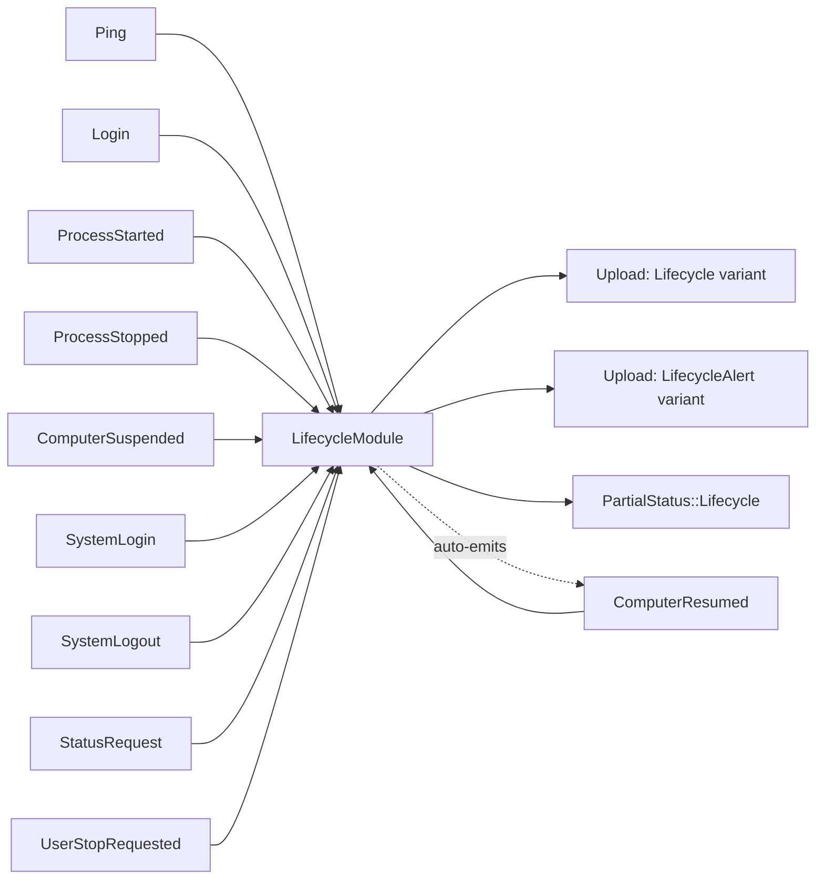
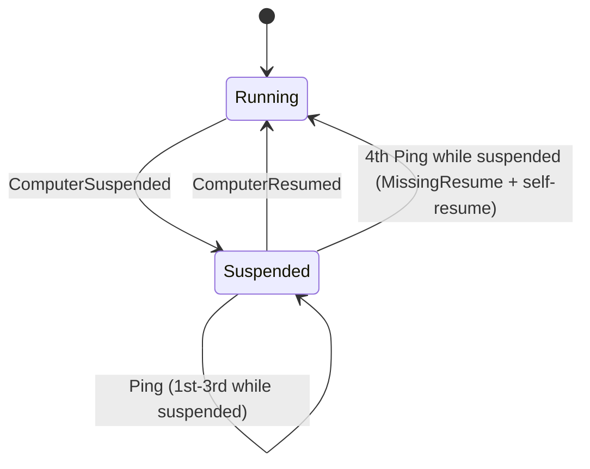
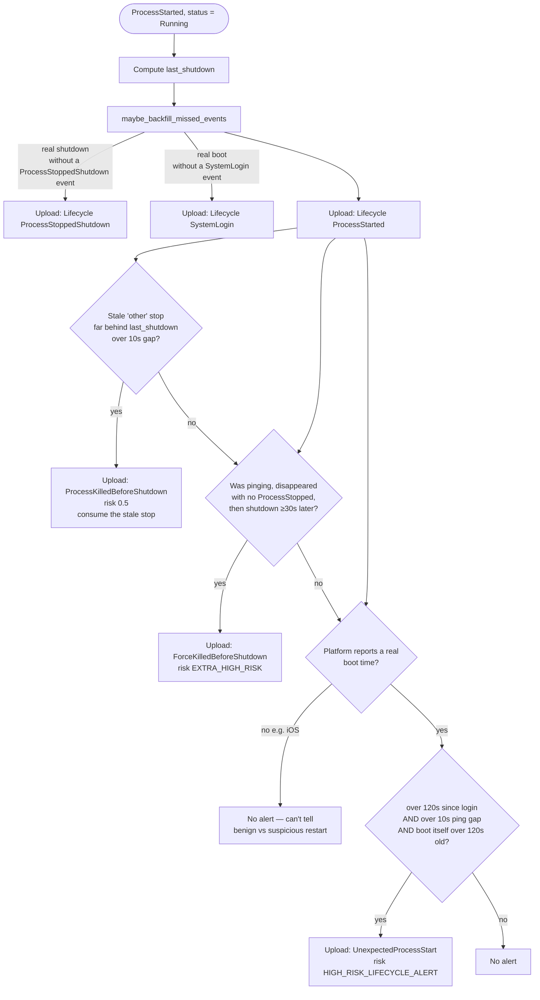
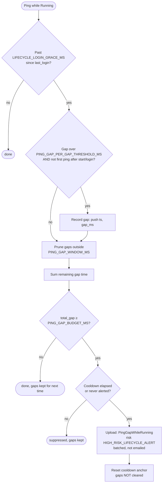

# Lifecycle events

Last Updated: 2026-07-08

`LifecycleModule` (`client/core/src/module/lifecycle.rs`) is one of the seven
observers on the client's event bus. It watches process and OS lifecycle
events — start/stop, suspend/resume, session login/logout, and the periodic
`Ping` — and turns them into `Upload` events: routine lifecycle records for
the timeline, and risk-scored alerts when something looks wrong (a force
kill, a missed resume, a stalled monitoring loop). This page diagrams the
module's inputs/outputs and its three most intricate pieces of logic.

## Overview

The module keeps a small state machine (`Running` / `Suspended`) plus a set
of timestamps and a sliding window of ping gaps. Every inbound event either
updates that state, emits a routine `Lifecycle` upload, emits a
`LifecycleAlert` upload, or (for `StatusRequest`) reports the current status
back through `PartialStatus::Lifecycle`.

The self-loop on `ComputerResumed` is deliberate: if the module concludes a
resume was missed (see below), it emits `ComputerResumed` back onto the bus
itself, so the rest of the system recovers without needing a real OS signal.

## Suspend/resume state

`LifecycleStatus` only has two states. Most transitions are a direct
`ComputerSuspended` → `ComputerResumed` pair, but if the resume signal never
arrives, a self-recovery path kicks in: the module counts pings received
while suspended, and once a 4th ping lands with the module still marked
`Suspended`, it treats that as proof the OS must have resumed, fires a
`MissingResume` alert, and emits `ComputerResumed` itself
(`handle_ping_suspended`, lifecycle.rs:354-367).

## Process-started decision flow

`handle_process_started` (lifecycle.rs:155-238) runs whenever the client
process starts while the module still thinks it's `Running` (a `Suspended`
process start is ignored — see the `on_event` dispatch). It first backfills
any lifecycle events the client couldn't have sent because it wasn't running
to send them, emits the routine "process started" upload, and then runs
three independent, non-exclusive alert checks.

## Ping-gap sliding window

`handle_ping_running` (lifecycle.rs:295-352) only runs on platforms that
support sleep/wake detection, and only once the post-login grace period has
elapsed. A single slow loop iteration briefly stalling `Ping` shouldn't
alert on its own, so gaps are recorded into a sliding window and summed —
the alert fires on sustained gap _budget_, not any one gap.

Because `ping_gaps` is never cleared on alert, a chronic stall keeps
re-alerting every cooldown window, while a one-off burst simply ages out of
the 10-minute window on its own.

## Tunable constants

These are the non-obvious knobs behind the checks above, all defined at the
top of `lifecycle.rs`:

| Constant                        | Value  | Meaning                                                  |
| ------------------------------- | ------ | -------------------------------------------------------- |
| `LIFECYCLE_LOGIN_GRACE_MS`      | 120s   | No ping-gap alerts until this long after login           |
| `PING_GAP_PER_GAP_THRESHOLD_MS` | 10s    | Minimum size for a single gap to be recorded             |
| `PING_GAP_WINDOW_MS`            | 10 min | Sliding window gaps are summed over                      |
| `PING_GAP_BUDGET_MS`            | 60s    | Total gap time in the window that triggers an alert      |
| `PING_GAP_ALERT_COOLDOWN_MS`    | 5 min  | Minimum time between repeat ping-gap alerts              |
| `EXTRA_HIGH_RISK`               | 0.9    | Immediate/emailed alert threshold (e.g. force kill)      |
| `HIGH_RISK_LIFECYCLE_ALERT`     | 0.8    | Batched but noteworthy (e.g. ping gap, unexpected start) |
| `MEDIUM_RISK_LIFECYCLE_ALERT`   | 0.6    | Lower-priority alert (e.g. missing resume)               |

`HIGH_RISK_LIFECYCLE_ALERT` is intentionally kept just below
`EXTRA_HIGH_RISK`: the upload module routes `risk >= EXTRA_HIGH_RISK`
through the immediate, emailed path, so common non-urgent alerts ride the
normal batch instead of paging anyone.

## What actually generates each event, per platform

`LifecycleModule` only reacts to events; it never decides _when_ a login,
logout, suspend, or resume happened. That decision is made in
platform-specific code that has no shared abstraction beyond
`bus.send(...)` and the two boot/shutdown-time `PlatformHooks` (see
`architecture.md`). This section is the map from OS signal to bus event.

### Linux (`client/linux/src/daemon.rs`, `capture.rs`)

- **`SystemLogin`**: never sent explicitly. `LifecycleModule::maybe_backfill_missed_events`
  notices `get_last_startup_time_utc_ms()` (reads the `btime` line of
  `/proc/stat`) advanced past the stored `last_sent_boot` and synthesizes the
  upload on the next `ProcessStarted`/`Ping`.
- **`SystemLogout`**: sent from `record_shutdown_transition()` when the
  daemon catches `SIGTERM`/`SIGINT` — but only if the stop reason isn't
  `User` (an explicit tray/CLI stop shouldn't read as a "logout").
- **`ProcessStopped`**: reason is a heuristic, not a callback. On signal
  receipt, `classify_shutdown_reason()` shells out to
  `systemctl is-system-running` and `systemctl list-jobs` (2s timeout each)
  to check for state `stopping` or a queued `shutdown.target` job →
  `Shutdown`; otherwise `User` if `UserStopRequested` was seen over IPC, else
  `Other`. A hard `SIGKILL` or power loss isn't caught at all — the daemon
  just never gets to run this code, and the gap is picked up later via
  `get_last_shutdown_time_utc_ms()` backfill.
- **`ComputerSuspended` / `ComputerResumed`**: the systemd-logind D-Bus
  signal `org.freedesktop.login1.Manager.PrepareForSleep(start: bool)`,
  subscribed via `zbus` in `spawn_suspend_watcher()`. `start=true` →
  suspended, `start=false` → resumed. Requires systemd-logind on the system
  bus; there's no fallback on non-systemd distros.
- **`get_last_shutdown_time_utc_ms`**: runs `journalctl --list-boots -o json`
  and reads the `last_entry` timestamp of the boot with `index == -1` (the
  previous boot). Needs persistent journald logging (`Storage=persistent`);
  returns `None` otherwise.

### macOS (`client/mac/src/daemon.rs`, `capture.rs`)

- **`SystemLogin`**: same as Linux — never sent explicitly, inferred from
  `get_last_startup_time_utc_ms()` (parses `sysctl -n kern.boottime`)
  advancing past `last_sent_boot`.
- **`SystemLogout`** and **`ProcessStopped(Shutdown)`**: both sent together
  from the `PowerEvent::WillPowerOff` handler, driven by
  `NSWorkspaceWillPowerOffNotification` observed on a dedicated
  `ShutdownWatcher` thread via `NSWorkspace.notificationCenter()`. This is
  "will power off," not a completion guarantee — an abrupt power loss or
  forced kill bypasses it, in which case `ProcessStopped` instead comes from
  the `SIGTERM`/`SIGINT` handler with reason `Other`.
- **`ComputerSuspended` / `ComputerResumed`**: IOKit system power
  notifications via `IORegisterForSystemPower`, running its own `CFRunLoop`
  on a dedicated thread. `kIOMessageSystemWillSleep` → suspended;
  `kIOMessageSystemHasPoweredOn` → resumed (and also fires `FlushBatchNow`,
  plus a 30s suppression window on screenshot-capture-state logging to avoid
  noise right after wake).
- **`get_last_shutdown_time_utc_ms`**: shells out to `last -1 -F shutdown`
  and parses the BSD `last` output for the most recent `shutdown` line;
  depends on `wtmp` history being intact.

### Windows (`Virtue.WindowsApp.Core/Tray/WindowsTrayIconHost.cs` + `client/windows/src/{ffi.rs,resident_monitor.rs,capture.rs}`)

Windows is the odd one out: the OS-signal detection lives in the C# WinUI
tray app (which owns a hidden window and its `WindowProc`), and crosses over
FFI into the Rust monitor thread, which then calls `bus.send(...)`.

- **`SystemLogin`**: `WM_WTSSESSION_CHANGE` with `wParam == WTS_SESSION_LOGON`
  (requires `WTSRegisterSessionNotification` at startup) → C# raises
  `SessionLogonObserved` → `RustInteropClient.NotifySessionLogon()` →
  `virtue_windows_notify_session_logon` FFI → `bus.send(SystemLogin)`.
- **`SystemLogout`**: deliberately _not_ driven by
  `WM_WTSSESSION_CHANGE`'s logoff variant, because `WTS_SESSION_LOGOFF` also
  fires on a full shutdown/restart (a session logs off as part of powering
  down) — that would conflate the two. Instead `WM_ENDSESSION` is used:
  when its `lParam`'s `ENDSESSION_LOGOFF` bit is set → session logoff path
  (`SystemLogout` + `ProcessStopped(Other)`); when unset → shutdown path
  (`SystemLogout` + `ProcessStopped(Shutdown)`). A separate tray-exit path
  (`ExitRequested` → user clicks "Exit") sends `UserStopRequested` then
  `ProcessStopped(User)` with no `SystemLogout`.
- **`ComputerSuspended` / `ComputerResumed`**: `WM_POWERBROADCAST` with
  `wParam == PBT_APMSUSPEND` → suspended; `PBT_APMRESUMEAUTOMATIC` or
  `PBT_APMRESUMESUSPEND` → resumed.
- **`get_last_startup_time_utc_ms`**: despite the name, this returns the
  _current user's logon time_, not system boot time — since Virtue starts at
  user login rather than system boot on Windows, that's the meaningful
  "startup" here. Read via `LsaGetLogonSessionData` off the process token's
  `AuthenticationId`.
- **`get_last_shutdown_time_utc_ms`**: reads the `ShutdownTime` `REG_BINARY`
  value under `HKLM\SYSTEM\CurrentControlSet\Control\Windows`, which Windows
  only writes on a clean shutdown — abrupt power loss won't update it.

### Android and iOS (`client/android/rust/src/lib.rs`, `client/ios/rust/src/lib.rs`)

Neither mobile platform sends `ComputerSuspended`, `ComputerResumed`,
`SystemLogin`, or `SystemLogout` — this is a deliberate scope decision, not
a gap:

- **Android** runs the monitor as a persistent foreground service that keeps
  executing through screen lock, so a ping stall is never a benign
  OS-suspend artifact in the first place; `PlatformConfig::default()`
  (`supports_sleep_wake_detection: true`) is kept as-is.
  `get_last_startup_time_utc_ms` derives boot time via JNI from
  `SystemClock.elapsedRealtime()` (uptime since boot, survives deep sleep);
  `get_last_shutdown_time_utc_ms` is hardcoded to `None`.
- **iOS** hosts monitoring inside a short-lived Safari App Extension with no
  `UIApplication`, which the OS can suspend the instant the device locks
  with zero notification delivered — there's no way to tell a benign lock
  from a suspicious stall, so `PlatformConfig::supports_sleep_wake_detection`
  is set to `false`, which turns off `handle_ping_running`'s gap check
  entirely (see `ping_gap_is_not_evaluated_when_sleep_wake_unsupported`).
  Both boot/shutdown hooks are hardcoded to `None`, which is also why the
  `UnexpectedProcessStart` check in `handle_process_started` is gated on a
  known boot time — see `unexpected_process_start_requires_known_boot_time`.

Both platforms still send `ProcessStarted`/`ProcessStopped` around their own
daemon-loop lifetime, with `ProcessStoppedReason::User` when the user
explicitly stopped monitoring and `Other` otherwise.
