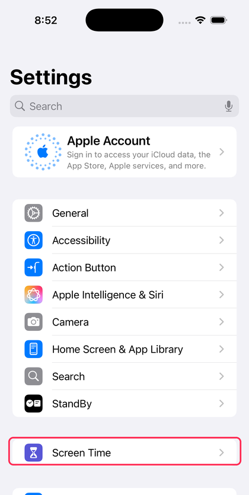
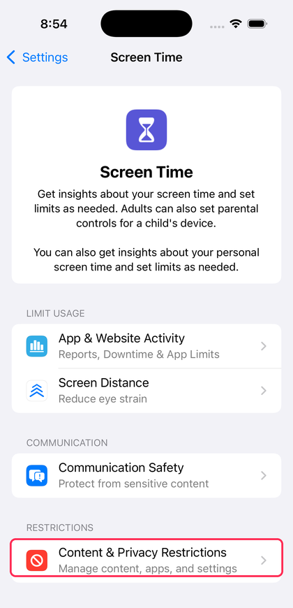
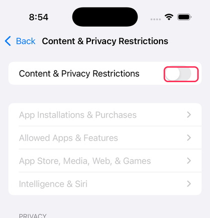
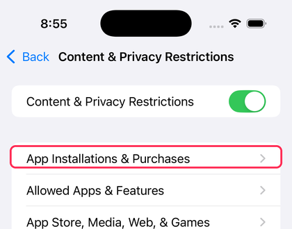
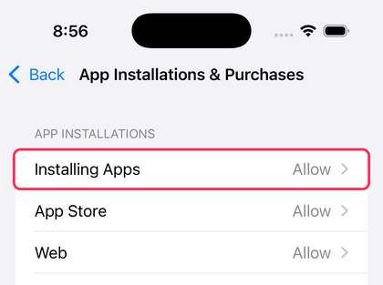
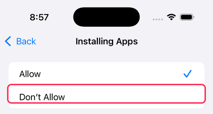
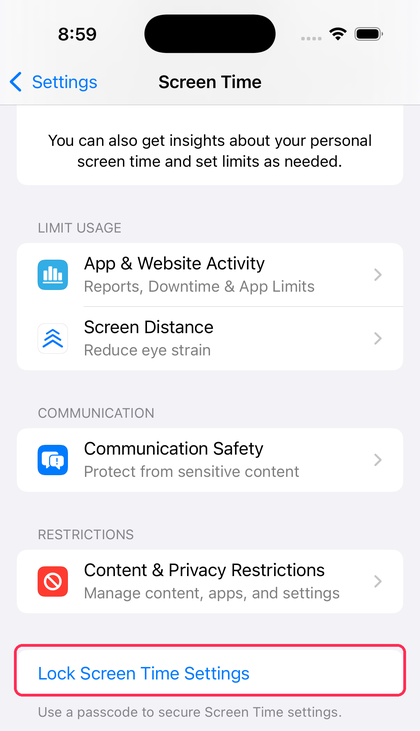
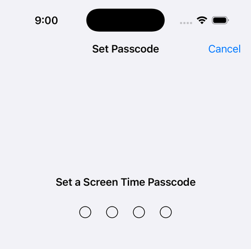

# Block app installs (iPhone)

Use Screen Time to stop new apps from being installed, such as non-Safari web browsers.
You will need your accountability partner with you to set the passcode, so you cannot
turn the block off yourself.

## Set up the block

1. Open **Settings** and tap **Screen Time**.
   
2. Tap **Content & Privacy Restrictions**.
   
3. Turn on **Content & Privacy Restrictions**.
   
4. Tap **App Installations & Purchases**.
   
5. Tap **Installing Apps**.
   
6. Select **Don't Allow**.
   

The App Store icon disappears from the Home Screen. No new apps can be
installed from the App Store, the web, or anywhere else.

## Lock it with a passcode only your partner knows

7. Go back to the main Screen Time page and tap **Lock Screen Time Settings**.
   
8. Hand the phone to your accountability partner. Have them enter a passcode
   twice without you watching.
   

Only your partner can turn this off now. Don't ask them for the passcode and
don't watch them type it.

## Back up the passcode with an alert

Your partner needs a backup of the passcode somewhere other than memory, in
case they forget it or aren't reachable. A plain note or message is risky:
if you ever come across it, the block is gone with no warning to anyone.

Instead, have your partner use [Canarytokens](https://canarytokens.org), a
free tripwire service that needs no account. They create a **Microsoft Word**
token, type the passcode straight into the document it gives them, and enter
their own email address for alerts. That document never expires. The moment
anyone opens it, an email lands in your partner's inbox right away.

Your partner saves that document somewhere private, like a notes app or cloud
drive, and never shares it with you.

If that notification email ever shows up, your partner knows the passcode was
found and should change it right away.
