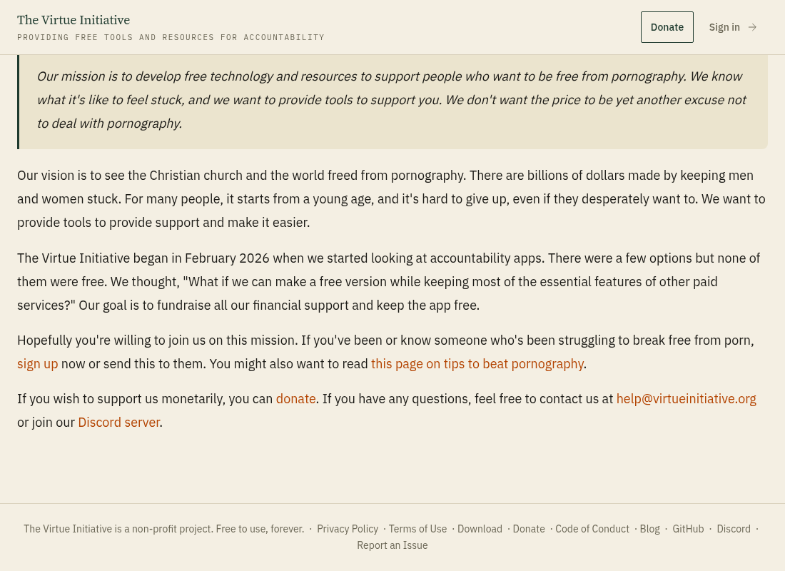
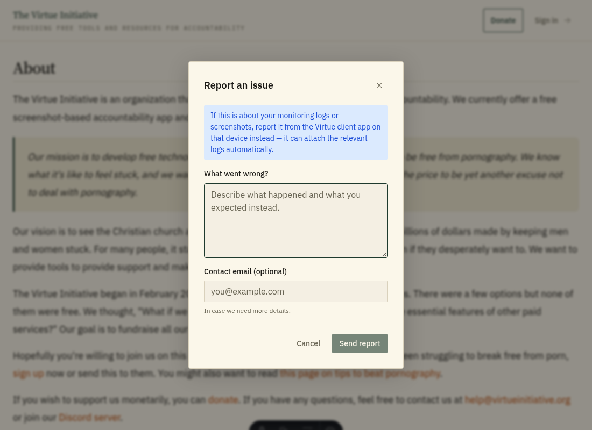
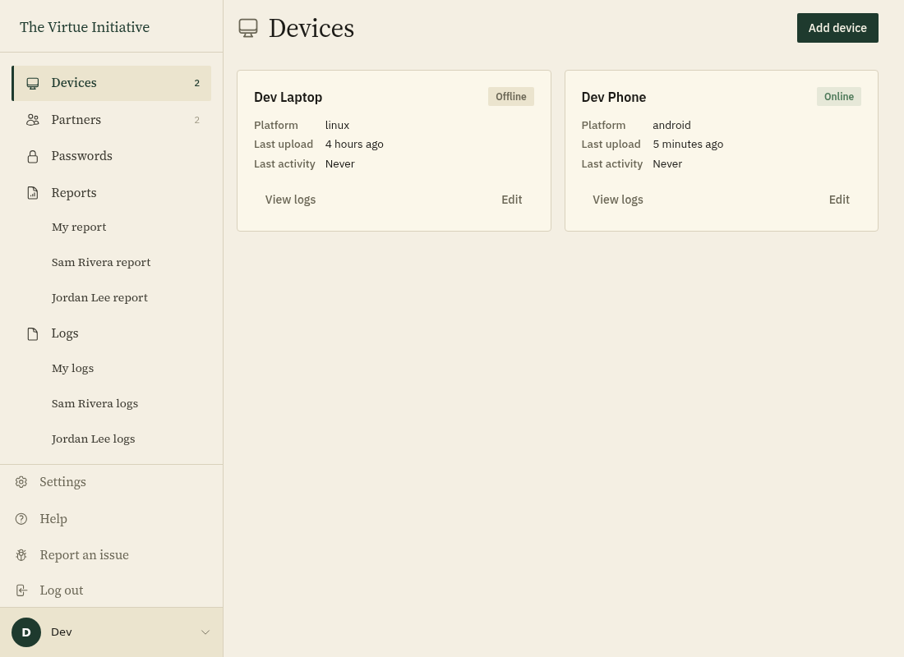
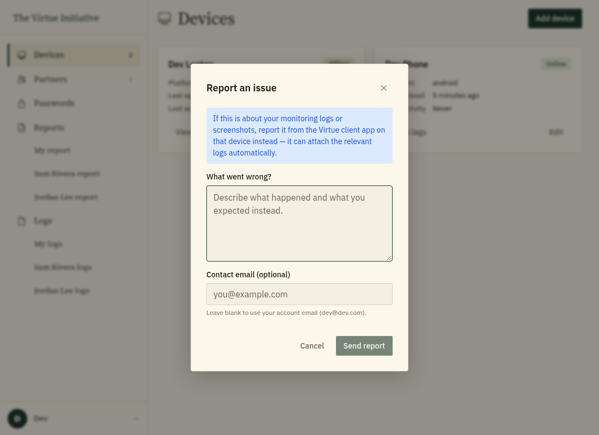

# Reporting an issue

Virtue is still being tested, so you may run into rough edges. Reports are the
fastest way for us to find and fix them. Every report goes straight to the
Virtue team.

Report from the place where you hit the problem when you can. Reports sent from
an app on a device can attach recent logs from that device, which makes problems
much easier to track down.

## On the website

1. Click **Report an Issue** in the footer of any page on this site.
   
2. Describe what happened and what you expected instead. Add a contact email if
   you would like a reply, then click **Send report**.
   

## In the web app

1. Click your name at the bottom of the sidebar, then click **Report an issue**.
   
2. Describe what happened and click **Send report**. If you leave the contact
   email blank, we use your account email.
   

## In the apps

Each app has a **Report an Issue** option that opens a short form. Describe what
happened and send it.

- **Windows:** Click **Report an Issue** in the main window, or right-click the
  Virtue icon in the system tray and choose **Report an Issue**.
- **Mac:** Click **Report an Issue** in the Virtue window.
- **Android:** Tap **Report an Issue** on the main screen.
- **iPhone and iPad:** Tap **Report an Issue** at the bottom of the Virtue app.
- **Linux:** Run `virtue report-issue` in a terminal and follow the prompts.

## What gets sent

A report includes the description you write, the contact email if you give one,
and basic details about your platform and app version. Reports sent from an app
also include a recent excerpt of that app's logs, with anything that looks like
a secret removed. Reports never include your screenshots. See the [privacy
policy](/privacy) for details.

You can also open an issue on [GitHub](https://github.com/virtue-initiative/virtue-initiative/issues).
