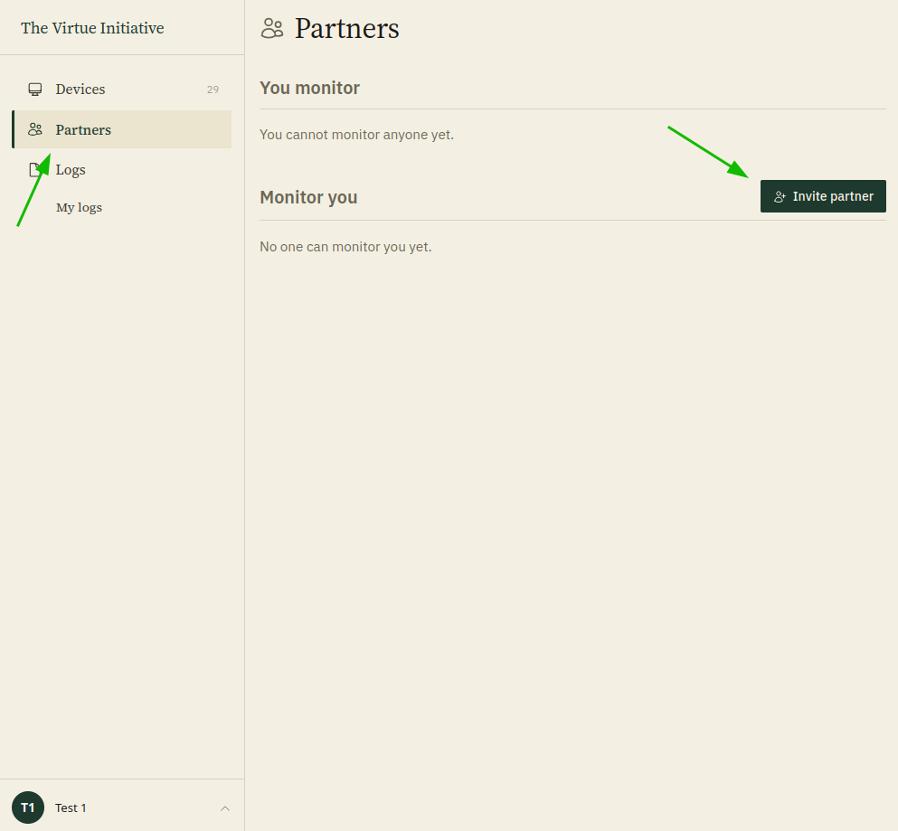
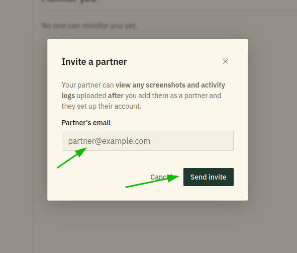
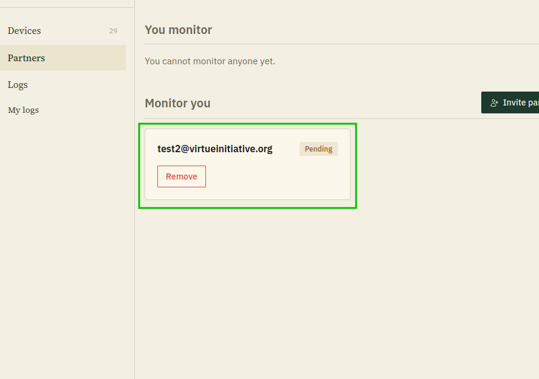

# Inviting a partner

1. Open the **Partners** page from the sidebar, then click **Invite partner**
   under **Monitor you**.
   
2. Enter your partner's email and click **Send invite**. An email will be
   sent to that address inviting them to accept.
   
3. Your partner will show up under **Monitor you** with a **Pending** badge
   until they accept the invite.
   

Your partner will only be able to see screenshots and activity logs uploaded
**after** you add them as a partner and they set up their account. Anything
uploaded before that stays hidden from them.
